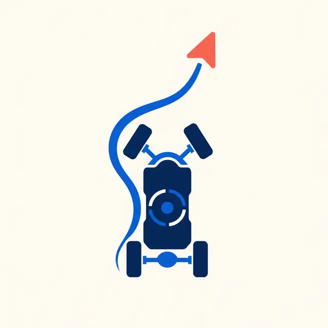
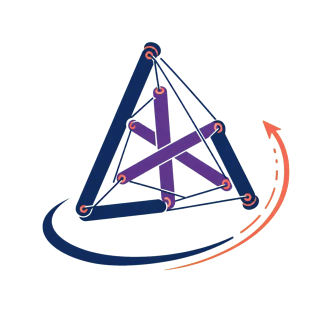
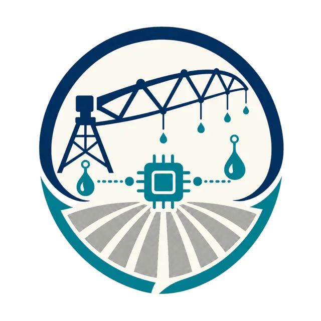

# Ahmed Othman

[](https://github.com/AhmadOthmann/AhmadOthmann.github.io/actions/workflows/quality.yml)

**Mechatronics Engineer · Robotics and Physical AI · TUM M.Sc. Student**

Munich, Germany · [Live portfolio](https://ahmadothmann.github.io/) · [LinkedIn](https://www.linkedin.com/in/ahmedothman-) · [Email](mailto:ahmad.mahmoud@tum.de)

I build robotic systems where autonomy software meets real hardware. My work spans control, embedded integration, mechanical prototyping, sensing and reliable interfaces for autonomous machines.

## Portfolio

This repository contains the source for [ahmadothmann.github.io](https://ahmadothmann.github.io/). GitHub Pages serves the site as plain HTML, CSS, JavaScript and optimized image assets. The published site has no application server or runtime package dependency. A dependency-free Node.js helper generates the three committed HTML pages from the translation files.

### Languages

Each language has a crawlable URL and can be selected from the site header:

| Language | URL | Direction |
|---|---|---|
| English | [ahmadothmann.github.io](https://ahmadothmann.github.io/) | Left to right |
| Deutsch | [ahmadothmann.github.io/de/](https://ahmadothmann.github.io/de/) | Left to right |
| العربية | [ahmadothmann.github.io/ar/](https://ahmadothmann.github.io/ar/) | Right to left |

The localized pages use appropriate `lang`, text direction, canonical and `hreflang` metadata. English is the default and `x-default` destination.

### Repository structure

| Path | Purpose |
|---|---|
| `i18n/*.json` | Source copy for English, German and Arabic |
| `tools/build-locales.mjs` | Generates the localized HTML pages with escaped content and page-specific metadata |
| `index.html`, `de/index.html`, `ar/index.html` | Committed GitHub Pages output; regenerate instead of editing by hand |
| `styles.css`, `script.js`, `theme-init.js` | Shared presentation, interactions and early preference initialization |
| `assets/` and root icon files | Project identities, social preview and installable-site icons |
| `.github/scripts/validate_site.py` | Dependency-free static-site validation |
| `.github/workflows/quality.yml` | Automated generation, metadata, asset and syntax checks |

### Design and accessibility

- Responsive layouts for mobile, tablet and desktop viewports
- Keyboard navigation, visible focus states and a skip-to-content link
- System, light, dark and high-contrast appearance options
- Optional larger text and reduced-motion preferences
- Semantic page structure and accessible labels for controls and project media
- Right-to-left layout support for Arabic
- Resume-based career groups for professional experience, research and education
- Project artwork with transparent backgrounds, including the Atlas Travel compass identity

Appearance and accessibility preferences are saved only in the visitor's browser. They are not transmitted to the site owner.

### Privacy and security

- Restrictive Content Security Policy with same-origin assets
- No cookies, analytics, advertising, trackers, forms or third-party runtime scripts
- No backend, database, authentication flow or repository secrets required by the site
- HTTPS and deployment infrastructure provided by GitHub Pages

GitHub may process standard service logs under its own policies. See [SECURITY.md](SECURITY.md) for the reporting process and technical boundaries.

## Selected work

| Identity | Project | Focus | Technologies |
|---|---|---|---|
|  | [Sofia Atlas Travel](https://github.com/AhmadOthmann/Sofia-Atlas-Travel) | Autonomous multilingual sales qualification and workflow observability | HappyRobot, Next.js, AI agents, webhooks |
|  | Autonomous Ackermann Vehicle | Localization, path tracking and embedded actuation | ROS, Gazebo, Raspberry Pi, IMU |
|  | EV Anti-lock Braking | Linear model predictive control for wheel-slip regulation | MATLAB/Simulink, MPC |
|  | Multi-Manipulator Pick and Place | Coordinated manipulation and visual localization | Robotics, ArUco, computer vision |
|  | Tensegrity Rolling Robot | Cable-actuated locomotion and compliant structures | Mechanical design, control, prototyping |
|  | Autonomous Irrigation | Distributed sensing and moisture-driven control | Microcontrollers, PWM, sensors |
|  | Connect Four AI Agent | Adversarial search and board-state evaluation | Python, algorithms, game AI |

All project identities are optimized WebP assets with alpha-transparent backgrounds.

## Engineering focus

- **Robotics and control:** ROS and ROS 2, Gazebo, SLAM, sensor fusion, MPC and PID
- **Embedded systems:** C++, ESP32, STM32, I²C, CAN and real-time control
- **Machine learning:** Python, PyTorch, TensorFlow and computer vision
- **Engineering tools:** MATLAB/Simulink, CAD, Linux, Git and Docker

## Local preview

If you change localized content or the page template, regenerate the committed HTML output:

```bash
node tools/build-locales.mjs
```

Then serve the repository through a local HTTP server so that routes and same-origin assets behave like the deployed site:

```bash
python3 -m http.server 8000
```

Then open:

- English: `http://localhost:8000/`
- German: `http://localhost:8000/de/`
- Arabic: `http://localhost:8000/ar/`

Opening the HTML files directly with a `file:` URL is not supported.

## Quality checks

Pull requests and pushes to `main` run a dependency-free quality workflow. It checks document metadata, localization routes, internal assets, accessibility essentials, security metadata, translation structure, the web app manifest and JavaScript syntax.

Run the same site validator locally:

```bash
node tools/build-locales.mjs
git diff --exit-code -- index.html de/index.html ar/index.html
python3 .github/scripts/validate_site.py
node --check script.js
node --check theme-init.js
```

The generator uses only built-in Node.js modules and the validator uses only the Python standard library. No package installation is required. A clean `git diff` confirms that the generated pages match the template and translations.

## Deployment

GitHub Pages publishes the static site from the repository's configured `main` branch. After a push, confirm the Pages deployment in the repository Actions tab and verify all three public language URLs.

## Contact

[LinkedIn](https://www.linkedin.com/in/ahmedothman-) · [GitHub](https://github.com/AhmadOthmann) · [ahmad.mahmoud@tum.de](mailto:ahmad.mahmoud@tum.de)
